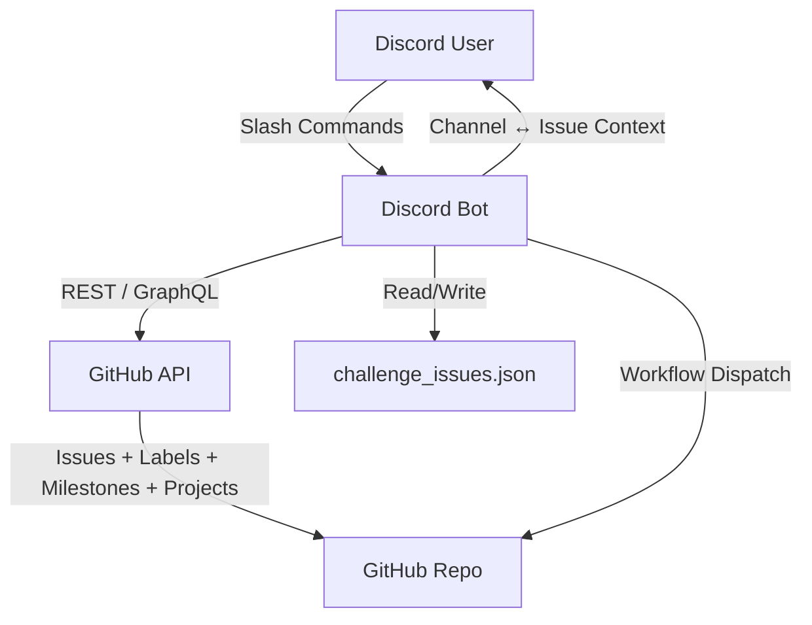

# CTF Pilot's Discord Bot

> [!CAUTION]
>
> This Discord bot is still in pre-release alpha stage, and is actively being worked on to make it stable.  
> This means that the bot may act in unexpected ways, and not be secure.
>
> **USE AT YOUR OWN RISK.**

CTF Pilot's Discord Bot is a Discord bot, designed to integrate into a challenge repository, allowing for developers to manage challenges directly from Discord.

## Overview

The Discord Bot accelerates CTF challenge development, by turning Discord into a challenge management and bootstrapping tool. Each challenge lives as an issue enriched with labels (Category, Difficulty, base `Challenge`), optional milestone, and optional Projects status field. Channels can be mapped to issues for contextual operations (e.g. updating status or difficulty without re-typing numbers).

## Key Features

- Slash command interface.
- Challenge creation with category, difficulty, status, and milestone.
- Automatic label provisioning to the target challenge repository.
- GitHub Projects integration (status field assignment via GraphQL).
- Repository issue workflow dispatch support (trigger actions/workflows), letting GitHub Actions handle further automation.
- Channel-to-issue linkage and metadata retrieval.
- Role-based access control for sensitive commands.

## How to run

### Prerequisites

In order to run the bot, you need to have:

- A Discord bot token with appropriate permissions (applications.commands, bot with message read/send).
- A GitHub Fine-grained Personal Access Token (PAT) with `content`, `issues`, `pull requests`, `projects` and `actions` with read and write.
- A target GitHub repository (e.g. `ctfpilot/ctfd-challenges`).
- Target repository has the challenge scaffolding GitHub Actions workflow located at `.github/workflows/create-chall.yml`, if using workflow dispatch.
- (Optional) A milestone name to apply to new issues.
- (Optional) A GitHub Projects v2 numeric project ID (not node ID).

### Docker Compose (recommended)

To run the bot using Docker Compose, first copy the example environment file and fill in the required values.
Then build and start the container:

```bash
cp .env.example .env   # Edit and fill in required values
touch challenge_issues.json  # Persistent mapping file

# Start the bot
docker compose build
docker compose up -d
```

A production Docker Compose file is available at `docker-compose.prod.yml`, which uses the latest released image.
Deploy it using:

```bash
docker compose -f docker-compose.prod.yml up -d
```

Issue -> channel mapping persistence is achieved by mounting a volume:

```yaml
volumes:
  - ./challenge_issues.json:/app/challenge_issues.json
```

*`challenge_issues.json` must be created before starting the container, otherwise the bot will fail to start.*

#### Docker image

A [Docker image](https://github.com/ctfpilot/discord-bot/pkgs/container/discord-bot) is automatically built and published to GitHub Container Registry for each release.  
You can pull the latest image with:

```sh
docker pull ghcr.io/ctfpilot/discord-bot:latest
```

*For the versions available, please see the [releases page](https://github.com/ctfpilot/discord-bot/releases).*

### Local (Python)

In order to run the bot locally for development or testing, create a Python virtual environment, install dependencies, and run the bot with the required parameters:

```bash
python3 -m venv .venv
source .venv/bin/activate
pip install -r src/requirements.txt
python src/main.py \
  --token "$DISCORD_TOKEN" --guild "$DISCORD_GUILD_ID" \
  --gh-token "$GITHUB_TOKEN" --gh-repo "$GITHUB_REPO" \
  --categories "web,crypto,pwn,misc" \
  --difficulties "easy,medium,hard" \
  --project-id 7 --status "Idea,Todo,In Progress,In Review,Done" \
  --allowed-roles "123456789012345678" \
  --milestone "CTF 2025" --verbose
```

*The bot requires Python 3.10+.*

## Configuration

Environment may be set via `.env`, Docker, or CLI flags. Required core variables must be present before startup or the bot exits early.

| Variable                | Required | Description                                                                            | Example                                |
| ----------------------- | -------- | -------------------------------------------------------------------------------------- | -------------------------------------- |
| `DISCORD_TOKEN`         | Yes      | Discord bot token                                                                      | `NAI...`                               |
| `DISCORD_GUILD_ID`      | Yes      | Guild ID for scoped sync & authorization                                               | `123456789012345678`                   |
| `DISCORD_ALLOWED_ROLES` | Yes      | Comma-separated role IDs allowed for privileged commands. Required to authorize users. | `111,222`                              |
| `GITHUB_TOKEN`          | Yes      | GitHub PAT (repo + project + workflow if needed)                                       | `ghp_xxxx`                             |
| `GITHUB_REPO`           | Yes      | Target repository (`owner/name`)                                                       | `ctfpilot/ctfd-challenges`             |
| `GITHUB_PROJECT_ID`     | No       | Numeric Projects v2 number (not node ID)                                               | `7`                                    |
| `CATEGORIES`            | No       | Comma-separated list of categories                                                     | `web,crypto,pwn,misc`                  |
| `DIFFICULTIES`          | No       | Comma-separated list of difficulties                                                   | `easy,medium,hard`                     |
| `STATUS`                | No       | Comma-separated list of project status values                                          | `Idea,Todo,In Progress,In Review,Done` |
| `MILESTONE`             | No       | Milestone applied to new issues                                                        | `CTF 2025`                             |
| `FLAG_PREFIX`           | No       | Prefix for flags before `{}` braces                                                    | `ctf`                                  |
| `REVIEW_STATUS`         | No       | Project status value considered "awaiting review"                                      | `In Review`                            |
| `REVIEW_LIMIT`          | No       | Maximum number of challenges shown by `/challenge reviews`                             | `10`                                   |

## Command Reference

All commands are slash commands. Authorization requires the invoking member to have at least one role ID in `DISCORD_ALLOWED_ROLES` and be in the configured guild.

- `/challenges [status] [page]`: Paginated list (10 per page) filtered by issue state (all/open/closed) or project board status.
- `/challenge`
  - `create`: Create challenge
    - `issue [name] [category] [difficulty] [status]`: Create challenge issue, and link it to the current channel
    - `code [issue_number] [name] [author] [category] [difficulty] [challenge_type] [instanced_type] [flag]`: Create challenge code scaffolding. Issue number, name, category, and difficulty may be skipped if run in a channel with a linked challenge issue.
  - `update`: Update challenge
    - `name [name] [issue_number]`: Update challenge name. Issue number may be skipped if run in a channel with a linked challenge issue.
    - `status [status] [issue_number]`: Update challenge status. Issue number may be skipped if run in a channel with a linked challenge issue.
    - `difficulty [difficulty] [issue_number]`: Update challenge difficulty. Issue number may be skipped if run in a channel with a linked challenge issue.
    - `category [category] [issue_number]`: Update challenge category. Issue number may be skipped if run in a channel with a linked challenge issue.
  - `info [issue_number]`: Show challenge metadata. Issue number may be skipped if run in a channel with a linked challenge issue.
  - `reviews [author]`: List challenges with status `REVIEW_STATUS` (default `In Review`), optionally filtered by GitHub assignee username. Shows up to `REVIEW_LIMIT` challenges with links to GitHub and, if linked, the Discord channel.
  - `link_channel [issue_number]`: Link current channel to issue
  - `clear_channel`: Clear current channel mapping

## Persistence

Mapping state lives in `challenge_issues.json` (mounted volume in Docker: `/app/challenge_issues.json`).

Example structure:

```jsonc
{
  "challenges": {
    "123456789012345678": 42
  }
}
```

## Architecture

| Component               | Responsibility                                                     |
| ----------------------- | ------------------------------------------------------------------ |
| `main.py`               | Startup, service initialization and lifecycle.                    |
| `config.py`             | Environment and CLI configuration loading.                         |
| `bot.py`                | Discord client creation, cog loading and slash command syncing.   |
| `cogs/`                 | Slash command cogs and dynamic cog loader. |
| `services.py`           | Runtime GitHub service setup and project resolution.               |
| `github_handler.py`     | Issues, labels, milestone, workflow dispatch, Projects v2 GraphQL. |
| `store.py`              | Thread-safe JSON persistence for channel → issue mappings.         |
| `logger.py`             | Structured logging with verbosity & debug control.                 |
| `utils.py`              | Command context, authorization helpers and input sanitization. |
| `challenge_issues.json` | Persistent datastore for mappings.                                 |

Diagram:



## Security

- Treat `DISCORD_TOKEN` / `GITHUB_TOKEN` as secrets; use Docker/K8s secret mounts.
- Limit GitHub token scopes (repo + project + workflow if needed; no admin).
- Rotate tokens periodically and audit usage.

> [!CAUTION]
> Privileged users can create repository issues, trigger workflows and mutate project status.
> Therefore, be cautious when assigning `DISCORD_ALLOWED_ROLES`.

## Troubleshooting

| Symptom                 | Likely Cause                        | Resolution                                              |
| ----------------------- | ----------------------------------- | ------------------------------------------------------- |
| Commands not visible    | Global sync delay                   | Provide `DISCORD_GUILD_ID` for scoped sync              |
| Labels not created      | Insufficient PAT scopes             | Ensure `repo` scope / correct fine-grained permissions  |
| Project status missing  | Wrong `GITHUB_PROJECT_ID`           | Confirm numeric project number; check debug logs        |
| Mapping not saved       | Volume not mounted or file perms    | Verify bind mount, container user permissions           |
| Workflow dispatch fails | Invalid workflow path / token perms | Check workflow name/path & `workflow` scope             |
| Authorization denied    | Role IDs mismatch                   | Confirm role IDs (not names) in `DISCORD_ALLOWED_ROLES` |

Enable `--debug` for detailed stack traces and request logging.

## Contributing

We welcome contributions of all kinds, from **code** and **documentation** to **bug reports** and **feedback**!

Please check the [Contribution Guidelines (`CONTRIBUTING.md`)](/CONTRIBUTING.md) for detailed guidelines on how to contribute.

To maintain the ability to distribute contributions across all our licensing models, **all code contributions require signing a Contributor License Agreement (CLA)**.
You can review **[the CLA here](https://github.com/ctfpilot/cla)**. CLA signing happens automatically when you create your first pull request.  
To administrate the CLA signing process, we are using **[CLA assistant lite](https://github.com/marketplace/actions/cla-assistant-lite)**.

*A copy of the CLA document is also included in this repository as [`CLA.md`](CLA.md).*  
*Signatures are stored in the [`cla` repository](https://github.com/ctfpilot/cla).*

## License

This component and repository is licensed under the **EUPL-1.2 License**.  
You can find the full license in the **[LICENSE](LICENSE)** file.

We encourage all modifications and contributions to be shared back with the community, for example through pull requests to this repository.  
We also encourage all derivative works to be publicly available under the **EUPL-1.2 License**.  
At all times must the license terms be followed.

For information regarding how to contribute, see the [contributing](#contributing) section above.

CTF Pilot is owned and maintained by **[The0Mikkel](https://github.com/The0mikkel)**.  
Required Notice: Copyright Mikkel Albrechtsen (<https://themikkel.dk>)

## Code of Conduct

We expect all contributors to adhere to our [Code of Conduct](/CODE_OF_CONDUCT.md) to ensure a welcoming and inclusive environment for all.
